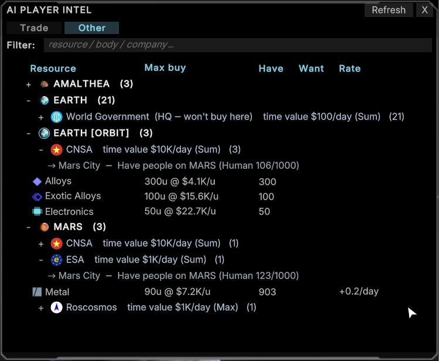
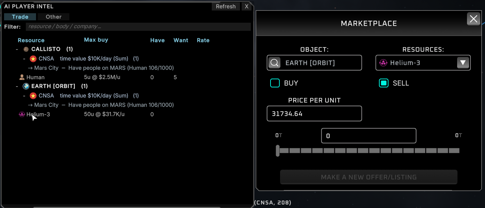

# AI Player Intel

AI companies in Solar Expanse already run a real trading strategy. You just never got to see it, let alone act on it. AI Player Intel puts that strategy on screen and within reach: click what a rival needs and jump straight to a pre-filled offer, no more dropping to the dev console to fake one by hand. A small contract premium keeps trading a notch more profitable than hoarding, so the AI keeps pace with you instead of falling behind.

![AI Player Intel panel: CNSA offers to buy Helium-3 it can't source quickly, shown beside the Earth [Orbit] body panel](docs/images/aiplayerintel-hero.png)

## What it does

Press F10 to open the intel panel: a tree of every body and AI company showing what each one has, wants, and the top price it would pay for a resource. It is sortable, filterable, and split into Trade and Other tabs, so you never have to guess what a rival needs before you undercut them. Spot a resource a rival wants and click it, and the Marketplace opens with an offer already filled in, so acting on the intel never means reaching for the dev console.

Underneath the panel, the mod also sharpens how the AI companies trade. An AI that has fallen behind on completed contracts starts valuing its own time more: it bids higher and leans on faster buy-now options instead of slow self-production. The leader is untouched, so the pack keeps pace without the game rubber-banding. AIs also pay more for what they genuinely need, so a company chasing a contract outbids one that is just browsing. That makes scouting who needs a resource, and selling to them specifically, a real strategy.

<table>
<tr>
<td width="50%"></td>
<td width="50%"></td>
</tr>
</table>

The market machinery gets the same treatment. When several AIs want the same thing you are selling, the mod briefly reserves the offer for whichever one is the best fit instead of resolving it by which one happened to check first; the reservation always expires on its own, so an offer never gets stuck waiting on an AI that changed its mind. AI companies also advertise standing buy orders sooner rather than quietly self-sourcing everything, giving you more listings to sell into. And if an AI cannot complete a step in its plan for too long, the mod forgives the missing resources and cancels the buy order that was blocking it, so it does not sit frozen for the rest of the game.

## Before / after

Vanilla AI companies buy and sell at flat prices with no sense of urgency, so a trailing rival can fall behind forever and contested offers resolve on a first-come basis. With this mod, price and priority both respond to how much an AI actually needs something and how far behind it is. The market feels alive instead of static.

## Configuration

Every behavior ships on by default, so a fresh install gives you the full experience with no setup. Settings live under the `Gate`, `CatchUp`, `NeedPremium`, `Stuck`, and `PostBids` sections of the config file.

`MasterEnable` (Gate) is the kill switch: turn it off and every behavior patch goes quiet, while the intel panel keeps working. Each feature also has its own toggle if you would rather trim the set. `CatchUp`, `NeedPremium`, `PostBids`, and the unstick logic can each be switched off individually, and `NeedPremium → Fraction` sets how big a premium (for example, `0.25` = 25% extra) a needy AI will pay. Raise it if AI bidding wars still feel too tame.

The full config file lives at `BepInEx/config/marr75.solarexpanse.aiplayerintel.cfg`. If you have [Configuration Manager](https://thunderstore.io/) installed, every setting (plus the F10 panel toggle and refresh rate) is editable live from an in-game menu, with no file editing or restarts needed.

## Requirements

- Solar Expanse + BepInEx 5 (Mono/x64).

## Install

1. Install BepInEx 5.
2. Drop the `AiPlayerIntel` folder into `BepInEx/plugins/`.

## Building (developers)

`dotnet build` deploys the DLL to the game's plugins folder via the post-build target. See `AGENTS.md`.
</content>
</invoke>
